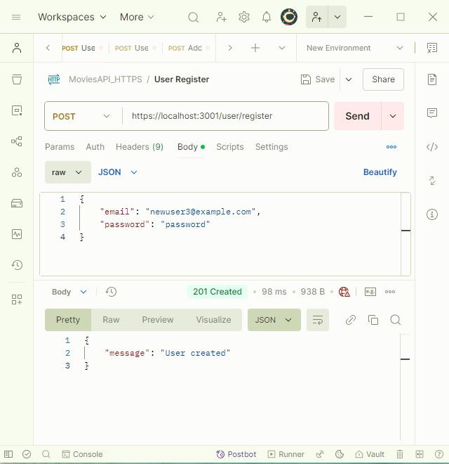
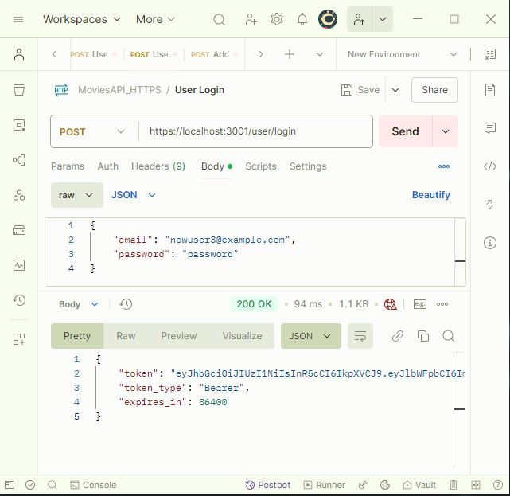
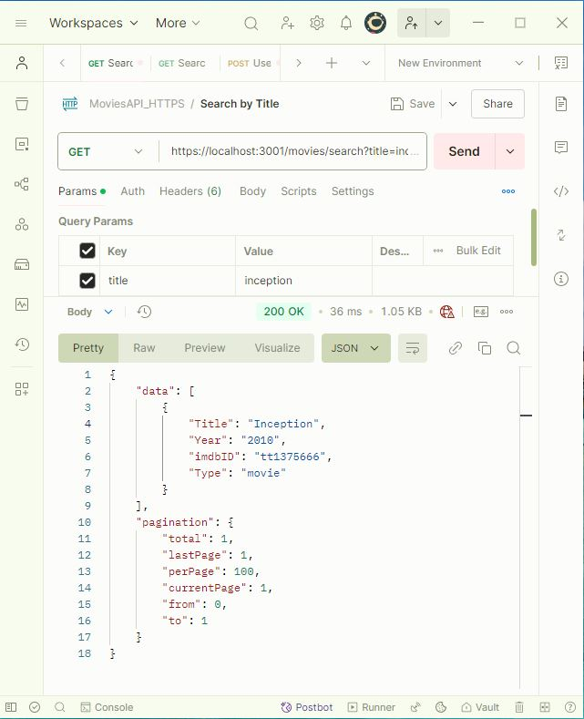
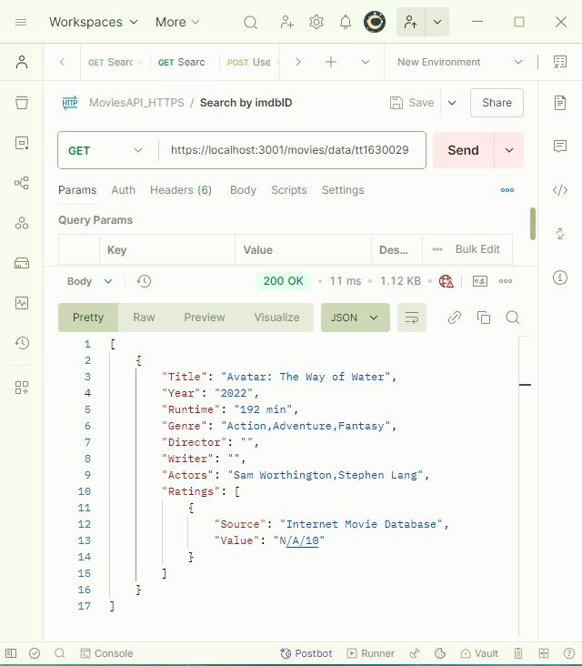
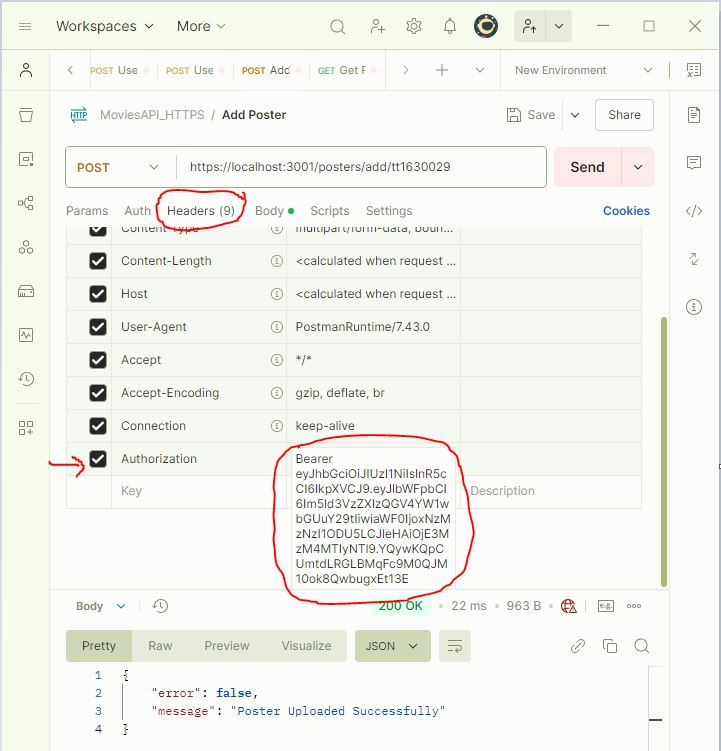
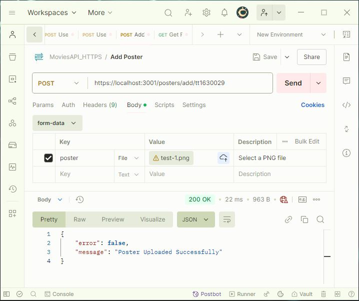
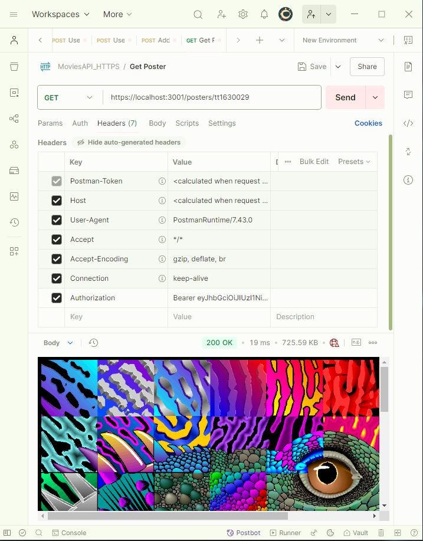

# Movie API

A secure REST API built with Node.js and Express that provides movie information from a MySQL database. The API requires HTTPS and implements JWT authentication for specific endpoints.

## Features

- User authentication (register/login) with JWT tokens
- Movie search functionality with pagination
- Detailed movie information retrieval
- Secure poster upload and retrieval system
- HTTPS/SSL implementation
- MySQL database integration using Knex.js

## Prerequisites

- Node.js (v14 or higher)
- MySQL (v5.7 or higher)
- SSL certificates for HTTPS

## Installation

1. Clone the repository
2. Install dependencies:

   ```bash
   npm install
   ```

3. Create a `.env` file in the root directory with the following variables:

   ```env
   PORT=3001
   DB_HOST=localhost
   DB_USER=your_db_user
   DB_PASSWORD=your_db_password
   DB_NAME=movies
   JWT_SECRET=your_jwt_secret
   ```

4. Place your SSL certificates in the appropriate directory and update the paths in `app.js`

## Start the Server in different ways

- `npm run dev` to start the server in **Development** mode with hot reloading
- `npm start` to start the server in **Production** mode

## Database Structure

The API uses a MySQL database with the following tables:

- `basics`: Core movie information
- `crew`: Director and writer information
- `names`: Person details (actors, directors, etc.)
- `principals`: Movie cast and crew relationships
- `ratings`: Movie ratings
- `users`: User authentication data

## API Endpoints (uses path parameters)

### Authentication

#### Register User

- **POST** `https://localhost:3001/user/register`
- Headers: `Content-Type: application/json`
- Body: `{ "email": "user@example.com", "password": "password" }`
- Creates new user account and returns a JSON object including a JWT token to be used for authentication in protected endpoints.



#### Login User

- **POST** `https://localhost:3001/user/login`
- - Headers: `Content-Type: application/json`
- Body: `{ "email": "user@example.com", "password": "password" }`
- Returns a JSON object including a JWT token.



### Movies (Public Endpoints)

#### Search Movies by Title

- **GET** `https://localhost:3001/movies/search`
- Query Parameters:
  - `title` (required): Search term
  - `year` (optional): Release year
  - `page` (optional): Page number
- Returns paginated movie results
- Example: `https://localhost:3001/movies/search?title=Avatar`



#### Get Movie Details by imdbID

- **GET** `https://localhost:3001/movies/data/{imdbID}`
- Returns detailed information about a specific movie
- Example: `https://localhost:3001/movies/data/tt1630029`



### Posters (Protected Endpoints)

a JWT token generated during login, must be passed in the header of the request.



#### Upload Movie Poster

- **POST** `https://localhost:3001/posters/add/{imdbID}`
- Headers: `Authorization: Bearer your_token_here`
- Requires JWT Authentication (in the Header)
- Accepts PNG image file
- Maximum file size: 5MB



#### Get Movie Poster

- **GET** `https://localhost:3001/posters/{imdbID}`
- Headers: `Authorization: Bearer your_token_here`
- Requires JWT Authentication (in the Header)
- Returns poster image for specified movie



## Security Features

- HTTPS/SSL encryption
- JWT authentication
- Password hashing using bcrypt
- CORS headers
- Helmet security middleware
- Request validation and sanitization

## Error Handling

The API implements comprehensive error handling with appropriate HTTP status codes:

- 200: Successful operation
- 201: Resource created
- 400: Bad request
- 401: Unauthorized
- 403: Forbidden
- 404: Not found
- 409: Conflict
- 500: Server error

## Database Connection

The API uses Knex.js as the SQL query builder. Database configuration is managed through `knexfile.js` and environment variables.

## Testing

API endpoints can be tested using Postman. Import the provided collection for testing all endpoints.

A few suggestions for improvements:

1. Implement more robust error handling for database operations
2. Add input validation for the movie search parameters
3. Consider implementing rate limiting
4. Add logging middleware for better debugging

## SSL Certificate Setup

### Development (Self-Signed Certificates)

1. Install required package:

```bash
npm install node-forge --save-dev
```

2. Generate certificates using the provided script:

```bash
npm run generate-ssl
```

This will create two files in the `ssl` directory:

- `key.pem`: Private key
- `cert.pem`: Public certificate

### Production

For production, use certificates from a trusted Certificate Authority (CA):

1. Purchase or obtain free certificates (e.g., Let's Encrypt)
2. Place the certificates in the `ssl` directory
3. Update paths in `app.js` if necessary

### Testing with Self-Signed Certificates

#### Postman

Option 1: Disable SSL verification

1. Settings → General
2. Turn OFF "SSL certificate verification"

Option 2: Add certificate to Postman

1. Settings → Certificates
2. Add your certificate under "CA Certificates"

#### Browser

When accessing the API, you may see a security warning because it's a self-signed certificate.

1. Click "Advanced"
2. Click "Proceed to localhost (unsafe)"

**Note:** Self-signed certificates should only be used for development. Always use trusted CA certificates in production.

## Expected Responses

### **user/register**

- Success (201):

  ```json
  { "message": "User created" }
  ```

- Error: User Exists (409):

  ```json
  { "error": true, 
    "message": "User already exists" 
  }
  ```

- Error: Incomplete Request (400):

  ```json
  { "error": true, 
    "message": "Request body incomplete, both email and password are required" 
  }
  ```

### **user/login**

- Success (200):

  ```json
  {
    "token": "ajsonwebtoken",
    "token_type": "Bearer",
    "expires_in": 86400
  }
  ```

- Invalid login request (400):

  ```json
  {
    "error": true,
    "message": "Request body incomplete, both email and password are required"
  }
  ```

- Login failed (401):

  ```json
  {
    "error": true,
    "message": "Incorrect email or password"
  }
  ```

### **movies/search**

- Success (200):

  ```json
  {
    "data": [
        {
            "Title": string,
            "Year": string,
            "imdbID": string,
            "Type": string
        }
    ],
    "pagination": {
        "total": number,
        "lastPage": number,
        "perPage": number,
        "currentPage": number,
        "from": number,
        "to": number
    }
  }
  ```

- Invalid year format (400):

  ```json
  {
    "error": true,
    "message": "Invalid year format. Format must be yyyy."
  }
  ```

### **movies/data/{imdbID}**

- Success (200):

  ```javascript
  [
    {
        "Title": string,
        "Year": string,
        "Runtime": string,
        "Genre": string,
        "Director": string,
        "Writer": string,
        "Actors": string,
        "Ratings": [
            {
                "Source": "Internet Movie Database",
                "Value": string
            }
        ]
    }
  ]
  ```

- Invalid query parameters (400):

  ```json
  {
    "error": true,
    "message": "Invalid query parameters: year. Query parameters are not permitted."
  }
  ```

**posters/{imdbID}**
200: The requested poster (image/png)
400: Invalid query parameters
401: Unauthorized
500: Poster not found

**posters/add/{imdbID}**
200: Poster uploaded successfully
400: Invalid query parameters
401: Unauthorized
500: Upload failed

## Author

Ebad Salehi
